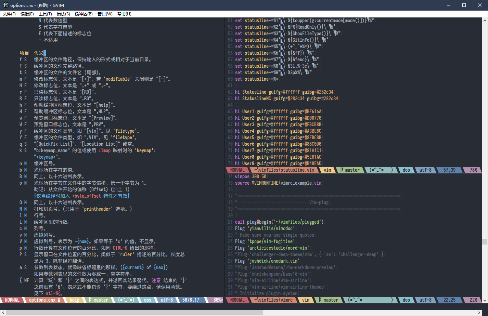

# My vimrc file

### Requires
* [vim-plug](https://github.com/junegunn/vim-plug)
* Chinese Font: [Sarasa Mono SC](https://github.com/be5invis/Sarasa-Gothic) | [Downoad](https://github.com/be5invis/Sarasa-Gothic/releases/download/v0.10.2/sarasa-gothic-ttf-0.10.2.7z)

### Instruction
My vimrc use [vim-plug](https://github.com/junegunn/vim-plug) as plugin manager.  
Use `git clone https://github.com/bickman/vimrc` to download to ~/vimfiles/.   
Run the PowerShell Script "DownPlugVim.ps1" or [here](https://github.com/junegunn/vim-plug) to download **Plug.vim** file and put it in **autoload** directory, start **gvim** and run `:PlugInstall`

### How it looks?

